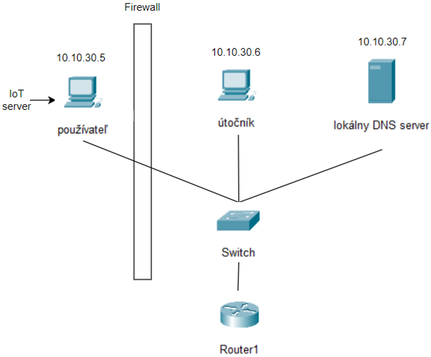

# bp-DNS_Rebinding

Tu si môžete stiahnuť virtuálne počítače a zdroje, ktoré potrebujete na vykonanie útoku DNS previazanie.

## Úvod
V tomto labe by študenti mali získať prvé skúsenosti s tým, ako používať techniku útoku DNS previazania na zariadenia internetu vecí. Na obrázku nižšie môžete vidieť, že tento lab obsahuje 4 virtuálne stroje. Prvý je router s IP adresou 10.10.30.1, druhý je klient (obeť) s IP adresou 10.10.30.5, tretí je útočník (vy) s 10.10.30.6 a posledný je server s IP adresou 10.10.30.7 . Vašou úlohou je získať prístup k termostatu, ktorý beží na virtuálnom stroji klienta a nastaviť na ňom teplotu.

## Ako funguje previazanie DNS
Útok sa zameriava na zariadenia internetu vecí (IoT). Mnohé z nich nemajú veľmi prepracované systémy ochrany. Ak sa útočníkovi podarí komunikovať s týmito IoT zariadeniami, pravdepodobne bude môcť zneužiť zraniteľnosť týchto zariadení.
##### Firewall -
útočník nemôže priamo pristupovať k zariadeniu IoT a ak by chcel, bude zablokovaný firewallom, pretože toto zariadenie IoT je súkromná IP adresa, ktorá nie je prístupná zvonku. Jediný spôsob ako môže útočník získať prístup k tomuto zariadeniu internetu vecí, je komunikovať so zariadením internetu vecí z miestneho prostredia. Útočník musí byť v rovnakej sieti za bránou firewall, aby sa k nej mohol dostať. Tento problém by sa dal vyriešiť tak, že klient navštívi webovú stránku útočníka. Čo musí útočník urobiť, je poslať používateľovi e-mail alebo reklamu a ak používateľ klikne na daný odkaz, prejde na webovú stránku útočníka.
##### The same origin policy -
zaisťuje, že používateľ môže komunikovať so svojím serverom. Pre IoT zariadenie (termostat) uvedieme príklad webovej stránky s názvom thermostat.com. Vďaka politike rovnakého pôvodu bude termostat schopný komunikovať s thermostat.com. Ak však útočník použije svoju stránku (attacker.com) na pokus o komunikáciu so serverom internetu vecí, ide o požiadavku z dvoch rôznych zdrojov. Je to preto, že útočník používa stránku attacker.com a termostat thermostat.com. Prehliadač preto útočníkovi neumožňuje získať údaje. Treba si však uvedomiť jednu vec. Politika rovnakého pôvodu kontroluje iba mená, nie IP adresy. Ak by teda používateľ získal IP adresu termostatu vedel by si na ňom nastaviť teplotu. Kedže IoT server beží na klientovej VM tak klientova IP = IoT IP.

## Inštalácia CSC
Ak si chce používateľ zahrať túto hru je potrebné si nainštalovať prostredie sandboxu a nastaviť softvér. Táto inštalácia je opísaná na stránke od kolegov z Masarykovej univerzity v Brne https://gitlab.ics.muni.cz/muni-kypo-csc/cyber-sandbox-creator/-/wikis/3.0/Installation - časť Chcem spustiť CSC sandbox.

## Inštalácia
Najprv musíte skopírovať tento repozitár do vášho počítača. Po stiahnutí prejdite do priečinka kde ste si ho rozhodli naklonovať a vstúpte do priečinka **muni-kypo_VMs**. Spustite tento príkaz:
 
*create-sandbox --provisioning-dir ./provisioning ./rebinding.yml*
 
toto by malo vytvoriť prechodnú definíciu sandboxu. Prejdite do priečinka **sandbox** a spustite tento príkaz:
 
*manage-sandbox build*
 
po chvíli sa vo virtual boxe zobrazia tri virtuálne stroje - router, server-wan a útočník.
 
Teraz musíte vytvoriť posledného - klienta. Prejdite do priečinka **vagrant_VMs/client**, ktorý sa nachádza v stiahnutom priečinku. Spustite tento príkaz:
 
*vagrant up*
 
po chvíli by ste mali vidieť klienta vo virtual boxe. Prvýkrát tento stroj vypnete a znova zapnete. Je to dôležité, pretože toto zariadenie sa prvýkrát nepripojí k sieti.

## Úlohy
Najprv musíte spustiť bash skript na klientovej VM. Spustite skript v bash - start.sh (./start.sh) a po chvíli by sa mal spustiť prehliadač firefox. V ňom bude zapnutý seedIoT webstránka kde budete môcť vidieť thermometer - IoT zariadenie.  
**Pozor**  
Po 20 minútach sa upravia pravidlá firewallu (zakáže sa prístup na localhost) a daný útok už nebude možné uskutočniť! Vy (útočník) máte teda len necelých 20 minút kým si klient všimne chybu v konfigurácii svojho firewallu a upraví pravidlá firewallu pre jeho IP adresu čo bude mať za následok to že zablokuje útok.
  
Na útočnom stroji:
Prihlasovacie údaje sú kali:kali. 
1. Prejdite na rebinding_repo. V tomto adresári sú zobrazené všetky súbory a prostriedky, ktoré budete potrebovať na to aby bol útok úspešný.  
    `cd rebinding_repo`
2. Skopírujte obsah _etc_bind_attacker do /etc/bind/named.conf. Týmto vytvoríte dve zóny na serveri DNS. Oba tieto súbory zóny sa použijú na iteratívne vyhľadávanie (názvu hostiteľa na IP adresu).  
    *príkazy napríklad:*  
    `cat _etc_bind_attacker` -> skopírujte obsah súboru  
    `sudo vi /etc/bind/named.conf` -> vložte obsah do tohto súboru
3. Skopírujte attacker.com.zone do priečinka /etc/bind. Tento záznam slúži pre iteratívne vyhľadávanie domény attacker32.com. Tu je uložené rozlíšenie DNS. Čitatelia, ktorí sa zaujímajú o syntax súboru zóny, si môžu pozrieť podrobnosti v RFC 1035.  
    `sudo cp attacker.com.zone /etc/bind`
4. Reštartujte službu bind9 a skontrolujte či je služba bind9 spustená. Pri každej zmene konfigurácie DNS je potrebné reštartovať server DNS.  
    `sudo systemctl restart named`   
    `sudo systemctl status named` -> ak si ste spravili všetko dobre status by mal byt running
5. Rozbaľte zip attacker_vm.  
    `sudo unzip attacker_vm`
6. Prejdite do priečinka attacker_vm.  
    `cd attacker_vm`
7. Spustite útočníkov web server. Po použití tohoto príkazu bude možné následne načítať webovú stránku u klienta.  
    `FLASK_APP=rebind_malware flask run --host 0.0.0.0 --port 8080`  
 
V ďalších krokoch používaj nové terminálové okno, flask je potrebné mať naďalej spustený!  

8. Použite URL adresu útočníkovho servera "attacker32.com" v súbore change.js. Pomocou toho dodržíme rovnakú politiku pôvodu a budeme môcť odoslať požiadavku na zmenu teploty na termostate. Ako si budete môcť všimnúť po vykonaní nižšie priloženého príkazu máme na prvom riadku v súbore povolený url prefix 'http://www.seediot32.com:8080'. V takejto konfigurácií sa teda požiadavka z útočníkovho servera posiela na server IoT zariadenia. Rovnaká politika pôvodu teda nie je dodržaná a takéto nastavenie nie je správne.  
    `sudo vi rebinding_repo/attacker_vm/rebind_malware/templates/js/change.js`  
    

    
Spoiler!

     
      let url_prefix = 'http://www.attacker32.com:8080' 
     
    

9. Reštartujte bind9.  
    `sudo systemctl restart named`

Prepnite späť do klientsky VM. Teraz zapnite novú kartu firefox a vyhľadajte webovú stránku http://www.attacker32.com:8080. Samozrejme v reálnom svete by používateľ dobrovoľne na takúto web stránku nevstúpi. Ako už ale poznamenané na začiatku, túto webovú stránku by vedel útočník poslať napríklad pomocou mailu alebo ako reklamu. Následne pokračujte na útočníkovom počítači. 

10. Zmeňte IP adresu www.attacker32.com v /etc/bind/attacker.com.zone aby sa požiadavka na zmenu teploty neposielala na útočníkovu IP ale na klientovu IP. Vďaka tomu bude sa požiadavka pošle na klientovu IP adresu a teda útočník bude môcť zmeniť teplotu na termostate a útok bude úspešný.  
    `sudo vi /etc/bind/attacker.com.zone`
    

    
Spoiler!

     
      www     IN      A       &lt;ip_addr Client&gt; 
     
    

11. Reštartujte bind9.  
    `sudo systemctl restart named`  

**Výsledok**  
Teraz prejdite na klientov stroj. Každých 10 sekúnd sa odošle požiadavka na zvýšenie tepolty na 88 stupňov. Ak  sa prekliknete na http://www.seediot32.com:8080 mali by ste vidieť výsledok vášho útoku - teplota je nastavená na 88 stupňov. Ak ju znížite tak opäť po prejdení 10 sekundového cyklu tak by sa mala opäť zmeniť. Samozrejme takto by stránka útočníka v reálnom svete nevyzerala, toto by bol v skutočnosti len skript ktorý by bežal na pozadí. Ak prejde aj spomínaných 20 minút od začiatku tak môžete skúsiť otestovať obranu, po prejdení 10 sekundového cyklu a odoslaní požiadavky sa už teplota nezmení, ostane nastavená tak ako bola.

### Zdroje 
https://seedsecuritylabs.org/Labs_16.04/PDF/DNS_Rebinding.pdf
